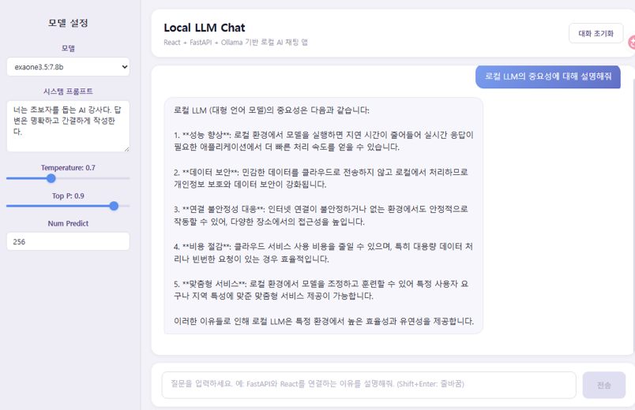
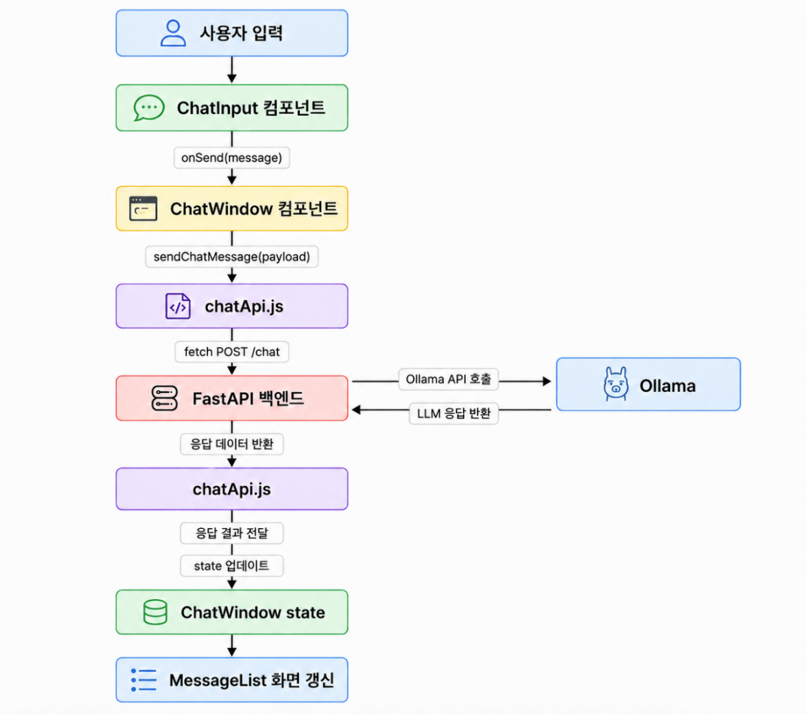

# 화면 UI 설계 내용

# 데이터 실행 흐름도

# 기본 명령
너는 React 프론트엔드 개발자다.
아래 조건에 맞춰 Vite 기반 React 로컬 LLM 채팅 앱을 구현해줘.
React + Vite 프론트엔드에서 FastAPI /chat API를 axios로 호출하는 채팅 앱을 구현해줘.
React, Vite, fetch 사용 방식은 최신 공식 문서 기준으로 작성해줘.
프론트엔드는 Ollama를 직접 호출하지 않고 FastAPI만 호출해야 해.
use context7

# 기술 조건:
- React + Vite
- JavaScript 사용
- TypeScript 사용하지 않음
- CSS는 일반 CSS 사용
- axios로 FastAPI 호출
- 상태관리는 useState만 사용
- API 호출 코드는 src/api/chatApi.js로 분리

# UI 설계 화면

- docs/image.png 이 위치의 이미지와 동일한 화면으로 UI를 구성한다.
- 각 기능이 정상적으로 동작되도록 한다.

# 1. 프로젝트 개요
본 프로젝트는 React + FastAPI + Ollama 기반의 로컬 AI 채팅 애플리케이션이다.  
사용자는 React 화면에서 질문을 입력하고, FastAPI 백엔드로 요청을 전송한다. FastAPI는 Ollama API를 호출하여 로컬 언어모델의 응답을 받아오고, React는 응답 결과를 채팅 UI에 표시한다.

# 2. 기술 스택
- Frontend: React, Vite
- Language: JavaScript
- Styling: CSS
- API Client: axios    
- Backend: FastAPI
- LLM Runtime: Ollama

# 3. 전체 연동 구조
User Browser
  ↓
React Frontend
  ↓
FastAPI Backend
  ↓
Ollama
  ↓
Local Language Model

# 4. React 컴포넌트 구조
App
  └─ ChatWindow
      ├─ SettingsPanel
      ├─ MessageList
      │   └─ MessageBubble
      └─ ChatInput
      
# 5. 환경변수의 파일
.env

# 6. backend 위치
backend/

# 7. 서버의 API
- local llm 모델명 가져오기 API : /models
- chat API : /chat
